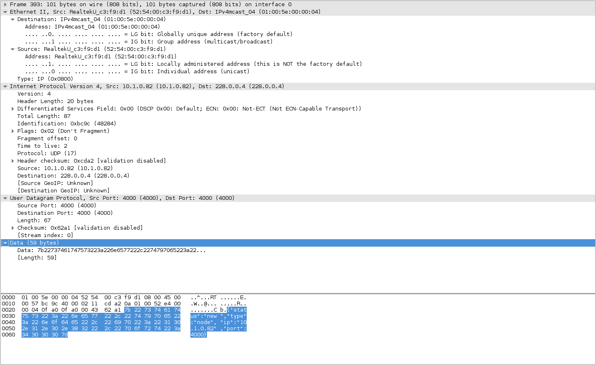

# express-session-multicast

> Multicast Session Replication for webclusters

This session module allows the user to share sessions across multiple servers by
using udp multicast messages sent from the first server at which the session has
been created and stored at runtime inside an instance of NeDB.

This is inspired by the way tomcat does session replication amongst nodes in a cluster.

## Configuration:

```javascript
	var express = require("express");
	var session = require("express-session");
	var SessionMulticast = require("express-session-multicast")(session);

	var app = express();
	var sess = session({
		secret: "test",
		resave: false,
		saveUninitialized: false,
		store: new SessionMulticast({
		    // multicast address to listen for at runtime
			multicast: "228.0.0.5",
			// port to recieve multicasts on
			multicastPort: 4000,
			// ip to report on start (NEVER set this to 127.0.0.1)
			ipv4: "10.1.0.81",
			// use IPv4 instead of v6
			use: "v4",
			// to set or not to set session time-to-live value (expiry)
			useSessionTTL: true,
			// expiry time for sessions
			sessionTTL: 1000,
			// multicast packet ttl (ie. 3 hops means 3 routers may be between this and the next server
			multicastTTL: 1,
			// logging facility ie. bunyan, console or winston
			logger: console
		})
	});
```

Based on this you'll need to allow servers access to 4000/udp in the firewall. In linux you may do it like this:

```shell
$> iptables -A INPUT -p udp -m state --state NEW -m udp --dport 4000 -j ACCEPT
```

This will put all incoming packets on port 4000/udp into the ACCEPT chain of iptables and lets them pass on
to the application listening on that port.

Also all cluster relevant traffic is sent to the broadcast address `228.0.0.5` you can see this in your
your a wireshark session as UDP traffic from an IP to the broadcast IP in wireshark like so:



The broadcast address shown here is the notification to the cluster that a new node has appeared in the cluster.

## How it works

Once the store has been initialized with a function call to the constructor (`new MulticastStore(/* options here*/)`)
the store will first evaluate the passed configuration and try to sanitize it as needed. After that it will
create a new socket using `udp4` from the datagram package or `udp6` (not implemented yet) depending on wether
you've set `use: "v4"` or `use: "v6"` in the configuration. Once the socket is bound to the configured port
(`multicastPort`) it will add itself to the broadcast membership list ont the configured `multicast` IP.

If the flag `gracefullShutdown` has been set it also creates an eventlistener callback on the process signal
`SIGINT` or `interrupt` signal which will fire a callback that will inform the rest of the cluster that this
node is going down and they may take this host out of their in memory database of hosts to trust and listen
for should they notifiy the node about an event.

Have these preliminairy steps been taken successfully it will send out a message to the broadcast IP with the
stringified JSON content:

```
 {
   status: "new",
   type: "node",
   address: "<IP of the server>",
   port: "<multicastPort>"
 }
```

This will introduce a new server to the exisiting cluster nodes. All other nodes are now asked to send back
a friendly greeting packet to the server introducing themselves to the new comer. The fastest of these
introductors will then be asked by the newcomer node to tell it the currently replicated set of sessions so
as to store them in its in-memory session database.


## Pros and Cons

### Con

This implementation and design may be constrained by the amount of memory you provide to each of your nodes.
It may not scale as much as a full storage backed session store that stores information for long running
sessions. 

### Pro

With this replication mechanism every other node of the service knows about the sessions as soon as they are
created and do not require to call back to an external source session store that may fail and take all session
information with it.

This reduces maintainance cost since you can simply tear down a node of the service, have it reconnect and
know exactly as much as the rest of the clust by simply talking to the other nodes.
